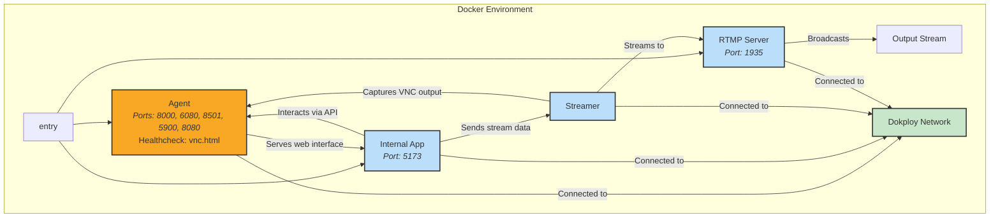

# Tradestream

Tradestream is an innovative 24/7 live streaming platform that brings an autonomous AI agent to life in a virtual environment. Its standout feature? The AI's actions are shaped by real-time community interactions, offering viewers a unique, participatory experience. Using **RTMP (Real-Time Messaging Protocol)**—a widely adopted standard for streaming audio, video, and data over the internet—Tradestream delivers seamless, low-latency broadcasts to audiences worldwide.

## Key Features

- **Continuous 24/7 Streaming:** Runs non-stop, ensuring viewers always have content to enjoy.
- **Community-Driven AI Behavior:** Viewers influence the AI through interactions like chat commands or voting (specific methods configurable), making every stream dynamic.
- **Secure VNC-Based Visualization:** Leverages **VNC (Virtual Network Computing)** to provide a secure, real-time view of the AI's environment.
- **Configurable Streaming Parameters:** Customize resolution, bitrate, and FPS to suit your bandwidth or quality preferences.
- **Containerized Architecture:** Built with Docker for consistent, hassle-free deployment across environments.

---

# Development

To start developing Tradestream locally, you'll need:

- **[Docker](https://docs.docker.com/get-docker/)**: Manages the containerized services.
- **[Bun](https://bun.sh/)**: A fast JavaScript runtime for building and running the app.

## Running Locally

Follow these steps to set up and run Tradestream on your machine:

1. **Install Dependencies**

   Install the required packages with:

   ```bash
   bun install
   ```

2. **Configure Environment Variables**

   Duplicate the example environment file:
   ```bash
   cp .env.example .env
   ```

   Edit `.env` with your settings. Key variables include:
   - ETHEREUM_PRIVATE_KEY: For blockchain integration (e.g., AI actions or payments).
   - STREAM_KEY: Authenticates the RTMP stream.
   - (Add others as needed based on your setup.)

   Generate an Ethereum address and private key:
   ```bash
   bun run scripts/generate-address.ts
   ```
   Why? This enables blockchain features, such as token-based interactions (adjust purpose as applicable).

   Optional: Sign up at the Coinbase Developer Platform for additional integrations and update .env accordingly.

3. **Build and Launch Docker Containers**

   Build the Docker images (first time only):
   ```bash
   bun docker:build
   ```

   Start the containers:
   ```bash
   bun docker:up
   ```

   Stop the containers when done:
   ```bash
   bun docker:down
   ```

Once running, access the internal app at http://localhost:5173 and the stream at rtmp://localhost:1935/live/stream (verify URLs based on your configuration).

### Watching your stream locally

```
ffplay -fflags nobuffer -flags low_delay -framedrop rtmp://localhost:1935/live/stream
```

Tip: Keep your .env file secure and never commit it to version control.

# Deployment

Tradestream deploys effortlessly with Dokploy on Hetzner. Dokploy simplifies container management, supporting any VPS or cloud environment with features like automatic SSL and monitoring.

## Deployment Process

1. **Set Up a Hetzner Server**: Sign up and provision a server with adequate resources.
2. **Install Dokploy**: Follow the Dokploy installation guide.
3. **Configure Dokploy**: Create a Tradestream project in the dashboard and set up services using your Docker Compose file.
4. **Add Environment Variables**: Mirror your local .env settings in Dokploy.
5. **Deploy**: Launch the containers and confirm they're running via Dokploy's interface.
6. **Access the Stream**: Connect to the stream using your server's domain or IP with an RTMP client.

For more, see the Dokploy documentation.

# Architecture Overview

This diagram outlines Tradestream's Docker-based architecture and component interactions:



## Next Steps

Ready to dive in? Clone the repo, set up Tradestream locally, and experiment with your own AI-driven stream. Have questions or ideas? Join our community or contribute via GitHub. Happy streaming!
