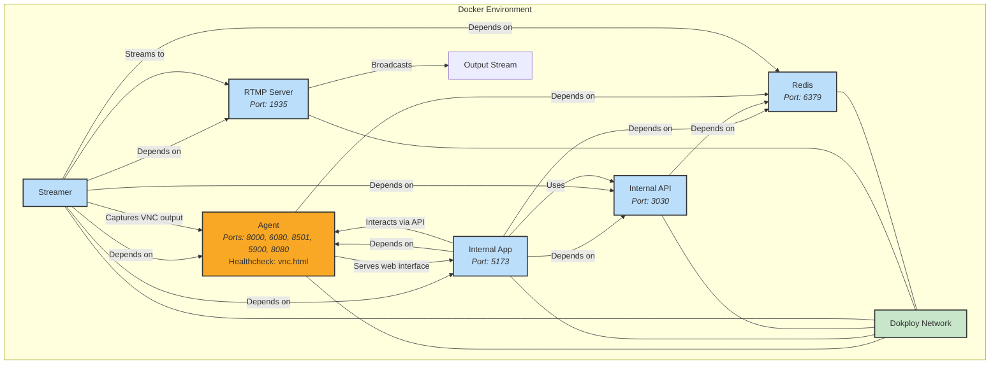

# Tradestream

Tradestream is an innovative 24/7 live streaming platform that brings an autonomous AI agent to life in a virtual environment. Its standout feature? The AI's actions are shaped by real-time community interactions, offering viewers a unique, participatory experience. Using **RTMP (Real-Time Messaging Protocol)**—a widely adopted standard for streaming audio, video, and data over the internet—Tradestream delivers seamless, low-latency broadcasts to audiences worldwide.

## Key Features

- **Continuous 24/7 Streaming:** Runs non-stop, ensuring viewers always have content to enjoy.
- **Community-Driven AI Behavior:** Viewers influence the AI through interactions like chat commands or voting (specific methods configurable), making every stream dynamic.
- **Secure VNC-Based Visualization:** Leverages **VNC (Virtual Network Computing)** to provide a secure, real-time view of the AI's environment.
- **Configurable Streaming Parameters:** Customize resolution, bitrate, and FPS to suit your bandwidth or quality preferences.
- **Containerized Architecture:** Built with Docker for consistent, hassle-free deployment across environments.
- **RESTful API:** Internal API for data management and integration with other services.

---

# Development

To start developing Tradestream locally, you'll need:

- **[Docker](https://docs.docker.com/get-docker/)**: Manages the containerized services.
- **[Bun](https://bun.sh/)**: A fast JavaScript runtime for building and running the app.

## Running Locally

Follow these steps to set up and run Tradestream on your machine:

1. **Install Dependencies**

   Install the required packages with:

   ```bash
   bun install
   ```

2. **Configure Environment Variables**

   Duplicate the example environment file:
   ```bash
   cp .env.example .env
   ```

   Edit `.env` with your settings. Key variables include:
   - ETHEREUM_PRIVATE_KEY: For blockchain integration (e.g., AI actions or payments).
   - STREAM_KEY: Authenticates the RTMP stream.
   - REDIS_PASSWORD: Password for Redis (optional, leave empty for no authentication).
   - (Add others as needed based on your setup.)

   Generate an Ethereum address and private key:
   ```bash
   bun run scripts/generate-address.ts
   ```
   Why? This enables blockchain features, such as token-based interactions (adjust purpose as applicable).

   Optional: Sign up at the Coinbase Developer Platform for additional integrations and update .env accordingly.

3. **Build and Launch Docker Containers**

   Build the Docker images (first time only):
   ```bash
   bun docker:build
   ```

   Start the containers:
   ```bash
   bun docker:up
   ```

   Stop the containers when done:
   ```bash
   bun docker:down
   ```

Once running, access the internal app at http://localhost:5173, the API at http://localhost:3030, and the stream at rtmp://localhost:1935/live/stream (verify URLs based on your configuration).

### Watching your stream locally

```
ffplay -fflags nobuffer -flags low_delay -framedrop rtmp://localhost:1935/live/stream
```

Tip: Keep your .env file secure and never commit it to version control.

# Deployment

Tradestream deploys effortlessly with Dokploy on Hetzner. Dokploy simplifies container management, supporting any VPS or cloud environment with features like automatic SSL and monitoring.

## Deployment Process

1. **Set Up a Hetzner Server**: Sign up and provision a server with adequate resources.
2. **Install Dokploy**: Follow the Dokploy installation guide.
3. **Configure Dokploy**: Create a Tradestream project in the dashboard and set up services using your Docker Compose file.
4. **Add Environment Variables**: Mirror your local .env settings in Dokploy.
5. **Deploy**: Launch the containers and confirm they're running via Dokploy's interface.
6. **Access the Stream**: Connect to the stream using your server's domain or IP with an RTMP client.

For more, see the Dokploy documentation.

# Architecture Overview

This diagram outlines Tradestream's Docker-based architecture and component interactions:



## Next Steps

Ready to dive in? Clone the repo, set up Tradestream locally, and experiment with your own AI-driven stream. Have questions or ideas? Join our community or contribute via GitHub. Happy streaming!


# Midcurve.live Project Info

## Why This Agent Is Bullish

### Thesis

24/7 Livestreamed AI – Midcurve.live is always on, showcasing real-time research, trades, and AI reasoning.

Community-Guided Trading – $MCRV holders influence the agent’s decisions, forming a crowd-sourced intelligence loop.

Transparent Execution – Every move is documented on a live stream, fostering trust and accountability.

Robust Architecture – Built on a new modern stack, fully containerized and self hosted.

### What Does $MCRV Do?

Token-Gated Influence – Holding $MCRV grants users direct sway over the AI’s trading strategies.

Telegram Integration – Quickly connect wallets, buy tokens, and interact with the agent via bot commands.

Real-Time Insights – Stay updated with the AI’s market analysis and trades as they happen.

Collective Decision-Making – Pool knowledge across the community, with the AI learning from user inputs.

### Growth Catalysts

Rising AI Trading Trend – Demand for AI-enhanced trading is surging, positioning Midcurve.live at the forefront.

Transparent, Engaging Format – The livestream approach and community input can attract wider adoption than typical AI bots.

Continuous AI Evolution – Rapid improvements fueled by 24/7 user feedback can boost both performance and user confidence.

### Team

Built by Luis aka microchipgnu and Markeljan aka Soko

We're seasoned innovators in Web3 and AI, having twice been finalists at ETHGlobal hackathons with projects W3GPT.ai, BecomeAGI.com, AIM.tools

Midcurve.live highlights our commitment to transparent AI, with direct community involvement unlike anything done before.
